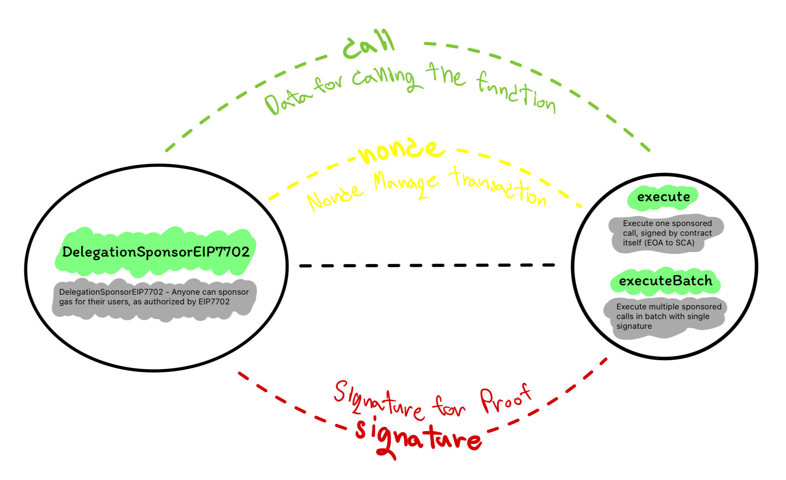

## EIP-7702
**DelegationSponsorEIP7702 - Anyone can sponsor gas for their users, as authorized by EIP-7702.**

Design:

Features:

-   **✅**: Use normal Public RPC (no API required).
-   **✅**: Use nonce to verify transaction sequence instead (Sponsor must send auth transaction first every time).
-   **✅**: SignMessage by user to verify before transaction.
-   **✅**: Signature will be signature from signMessage to verify again.
-   **✅**: Prevent Replay attack (EOA not allowed).
-   **✅**: Support single transaction and group transaction.
-   **✅**: Anyone can use this Delegate CA as Sponsor gas by themselves.

 

-   **❌**: Authorization[(spec)](https://eips.ethereum.org/EIPS/eip-7702) still requires pk to access account to sign.